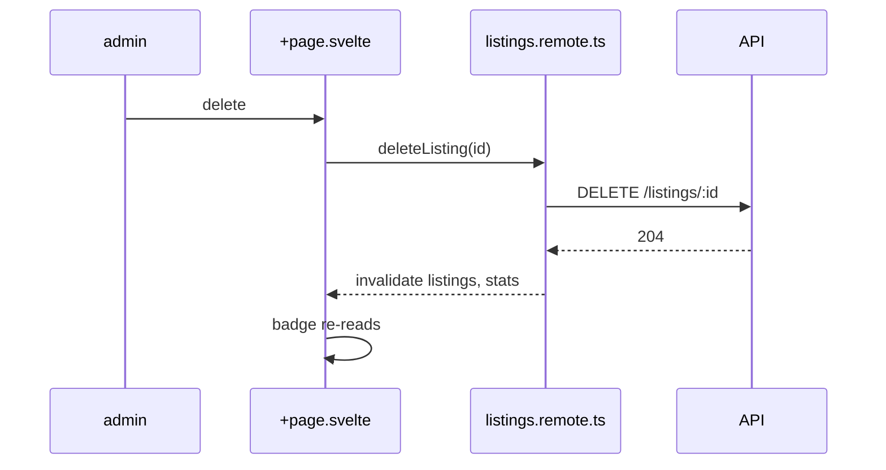

# SPEC — DEMO-1 · «the listings badge keeps the old count after a delete»

Demo round (not a real ticket) · reporter: demo, 2026-10-06 · Round `demo/DEMO-1`, base `dev`.
Bug/CR folder: `bug-reports/DEMO-1`.

**Class: B** — the delete command changes a `*.remote.ts` contract and the stats payload.

## For T1

**As-is** — the count is read before the delete lands, and the delete invalidates the wrong key.

```
  /admin/listings +page.svelte
    deleteListing                   ← id → void
      listings.remote.ts:31         invalidate('listings')      ⚠ the badge reads 'stats'
      ✗ the API refuses the delete  → lands: +page.svelte:52 deleteError
    ListingBadge.svelte:12          reads stats.total
```

**Build** — one invalidate call for both keys, and the badge reads the key the payload already carries.

```diff
 packages/admin/src/lib/listings.remote.ts
-  export const deleteListing = remoteCommand(async (id) => { await api.delete(id); invalidate('listings'); })
+  export const deleteListing = remoteCommand(async (id) => {
+    await api.delete(id);
+    invalidate('listings', 'stats')     one call, both keys
+  })

 packages/admin/src/routes/admin/listings/ListingBadge.svelte
~  :12  reads stats.total → stats.filtered ?? stats.total
```



**Asks**

> **ASK-1 (user) — should the badge show the total or the filtered count?**
> measured: today it shows the unfiltered total (`stats.total`); the filter chip reads `listings.length`. Either answer changes the payload, not the delete.

## As-is

`packages/admin/src/lib/listings.remote.ts:31` — the command invalidates one key:

```ts
 26  export const deleteListing = remoteCommand(async (id: string) => {
 27    await api.delete(`/listings/${id}`);
 30    // ⚠ the badge does not read this key
 31    invalidate('listings');
 32  });
```

`packages/admin/src/routes/admin/listings/ListingBadge.svelte:12` — and the badge reads the other:

```svelte
 12  {stats.total} listings          ⚠ never invalidated by a delete
```

Every other path that reaches the count, and the grep that says so: `deleteMany` (`listings.remote.ts:64`,
no `invalidate` at all), `createListing` (invalidates both — correct today), `bulkImport` (same as create).

Birth check: `git log -S"invalidate('listings')" --follow` — one commit, `feat(admin): delete a listing`,
the badge was added two days later and never wired.

## Input coverage

| # | value | source |
|---|---|---|
| 1 | the badge's number after a delete | ticket line · measured below |
| 2 | which count the badge shows (total, filtered) | **owed decision — ASK-1** |
| 3 | the delete error message | `+page.svelte:52` (unchanged) |

Row 2 is the only owed value: an engineering choice, so **B**, not C.

## Candidates

### A — the payload carries both counts, the badge picks

**Usage.** Unchanged for a caller; the badge gains no prop.
**Build views.**

```diff
 packages/admin/src/
 ├── lib/
 │   └── listings.remote.ts          ~ invalidate both keys
 └── routes/admin/listings/
     ├── +page.svelte                ~ passes stats
     ├── ListingBadge.svelte         ~ reads stats.filtered ?? stats.total
     └── listings.test.ts            + the delete-then-count case
```

```diff
 type ListingStats
   total: number
+  filtered: number        ~ the badge reads this when a filter chip is on
```

**Tests to write.** `delete then badge` — the count drops by one, filtered and unfiltered.
**Tradeoff.** For: one payload, no client state. Against: the API must compute `filtered` (`COUNT` per request).

### B — the badge derives from the list it already has

**Usage.** Unchanged.
**Build views.**

```diff
 GET /listings
 response
   listings: Listing[]
-  stats: { total: number }
+  stats: { total: number; filtered: number }   ~ B keeps stats, the badge ignores it
```

**Tests to write.** `badge reads listings.length` — no API change.
**Tradeoff.** For: no API change. Against: the badge and the filter now count two different lists, and the
total is the one the ticket is about.

## Questions

### INFER — decided here, from a named source

1. The delete must invalidate `stats` — `createListing` and `bulkImport` both do, and the badge reads it.

### ASK — the user (engineering)

> **ASK-1 (user) — should the badge show the total or the filtered count?**
> measured: today it shows the unfiltered total (`stats.total`); the filter chip reads `listings.length`. Either answer changes the payload, not the delete.

## Recommendation

Candidate A. The guarantee lives where the count is produced, so no screen can read a stale number; B moves
the guarantee into a component the next screen will not have. Still gated: ASK-1, and the `COUNT` per request
that `filtered` costs.
